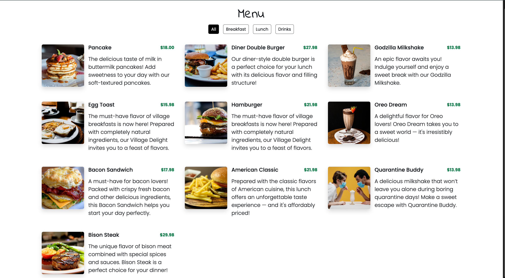
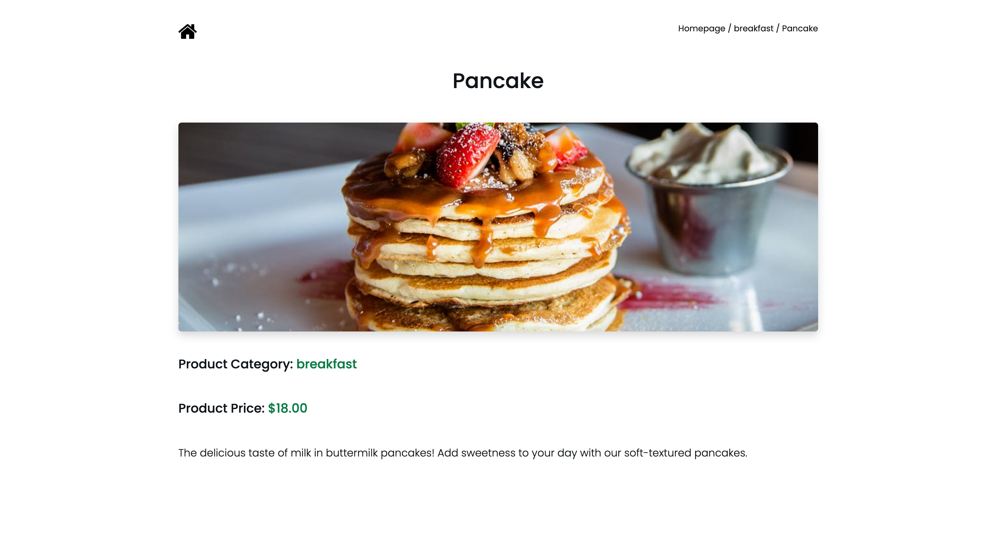
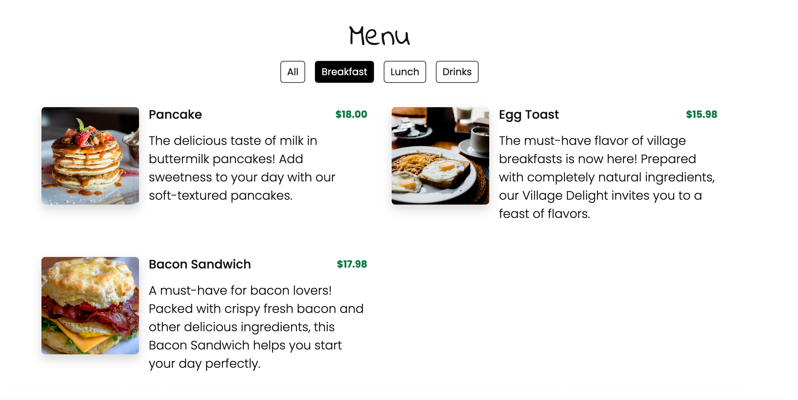
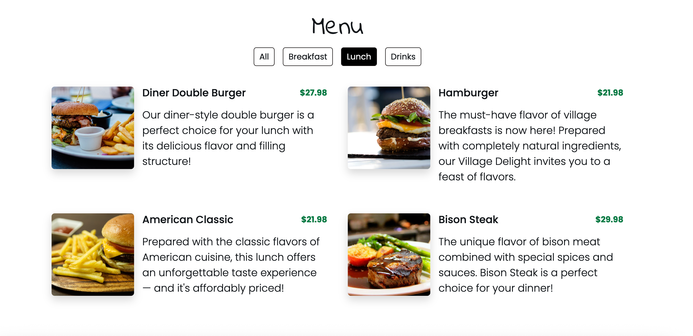
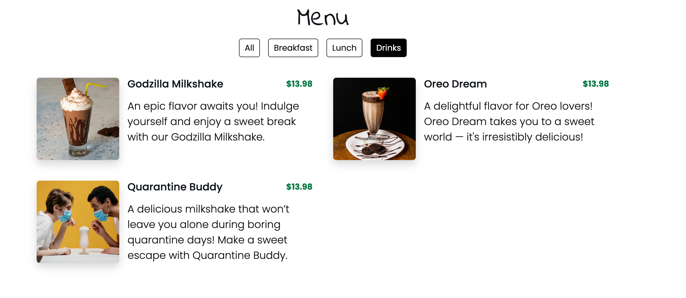

# QR Menu Project
This project is a dynamic food menu application built with HTML, CSS, JavaScript, and Bootstrap. It simulates a restaurant menu that allows users to view items by category and access a detailed view of each dish.

## DEMO
https://qr-application.netlify.app/

## Homepage

## Detail Page

## Breakfast

## Lunch

## Drinks

## Technologies Used

• HTML5  
• CSS3 & SCSS  
• JavaScript   
• Bootstrap 5  